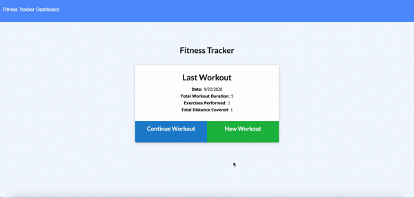

# Fitness Tracker
It creates and tracks daily workouts and users can log multiple exercises in a workout on a given day. Also, users can track the name, type, weight, sets, reps, and duration of exercise. For example, if the exercise is a cardio exercise, user will be able to track his/her distance traveled.

## Link
Please visit [Fitness Tracker](https://mighty-escarpment-23618.herokuapp.com/) site!

## Screenshots

## Built with
- [MongoDB](https://www.mongodb.com/cloud)
- [Heroku](https://id.heroku.com/login)
- [NPM](https://www.npmjs.com/)
